<div align="center">
  
</div>

<br>

<div align="center">

[](https://www.gnu.org/licenses/gpl-3.0)
[](https://www.android.com)
[]()
[](https://discord.gg/VQ7ps9K4n)
[](https://youtube.com/@craft-studio-official)

</div>

<br>

<div align="center">
  <strong>High-performance open-source Minecraft utility for Android — built with a Matte Black / Cyberpunk aesthetic.<br>Extreme optimization · Smart resource management · Seamless modding experience.</strong>
</div>

---

## ⚡ Core Architecture

> CS Launcher is not a wrapper. It is a precision-engineered runtime environment built from the ground up for mobile-first Minecraft.

<br>

### 🚀 Performance Engine

| Component | Technology | Result |
|---|---|---|
| **Garbage Collector** | G1GC — Mobile-tuned heap management | Zero stutter during chunk loading |
| **Thread Scheduler** | Dynamic pooling across all cores | 100% CPU utilization, no waste |
| **Memory Manager** | Per-session heap profiling + auto-recovery | No mid-game OOM crashes |
| **Frame Engine** | Engine-level FPS cap patches | **260+ FPS unlocked** |

<br>

### 💤 Deep Sleep™ Resource Manager

```
╔══════════════════════════════════════════════════════════╗
║           [ GAME SESSION DETECTED ]                      ║
╠══════════════════════════════════════════════════════════╣
║  → Suspending background sync .................. ✓       ║
║  → Parking idle CPU cores  ..................... ✓       ║
║  → Locking GPU thermal headroom ................ ✓       ║
║  → Applying G1GC mobile heap profile ........... ✓       ║
║                                                          ║
║  ██████████████████  ZERO LAG MODE ACTIVE                ║
╚══════════════════════════════════════════════════════════╝
```

- **Zero** background interference during extended sessions
- **Maximum** battery efficiency without sacrificing responsiveness
- **Instant** resume when returning to the launcher

<br>

### 🎮 Frame Rate Comparison

```
  Standard Android Limit ───────────▓▓▓▓▓▓░░░░░░░░░░░░░░░░░░░░░░░░░░  60 FPS
  CS Launcher Unlocked   ───────────▓▓▓▓▓▓▓▓▓▓▓▓▓▓▓▓▓▓▓▓▓▓▓▓▓▓▓▓▓▓▓  260+ FPS
```

> Automated engine patches that shatter hardware-imposed framerate caps. Smart VSync eliminates screen tearing without traditional input latency.

---

## 🛠️ Integrated Mod Ecosystem

```
📦 CS MOD MANAGER
│
├── 📥  1-Click .jar Installation
│       └─ Automatic dependency resolution
│
├── 🔍  Version Compatibility Scanner
│       └─ Pre-flight checks before every launch
│
├── 🗂️  Mod Profile System
│       └─ Swap entire mod loadouts instantly
│
└── 🎨  Global Theme Engine
        └─ High-contrast & minimalist UI themes
```

---

## 📺 Official Community

<div align="center">

| Platform | Channel | Link |
|:---:|:---:|:---:|
| 🎬 YouTube | Craft Studio Official | [Subscribe](https://youtube.com/@craft-studio-official) |
| 💬 Discord | Craft Studio Server | [Join](https://discord.gg/VQ7ps9K4n) |

</div>

---

## 📜 Credits & Acknowledgements

CS Launcher stands on the shoulders of the open-source community. Full respect and attribution to every project that made this possible.

| Project | Role | Attribution |
|---|---|---|
| **PojavLauncher Team** | Core Foundation | Significant portions of this project utilize modified source code from their foundational work. Their original **GPLv3** license is fully respected and upheld. |
| **LWJGL** | Native Libraries | Cross-platform native library bridging |
| **Minecraft** | Game | A product of Mojang AB and Microsoft |

---

## ⚖️ License & Legal

**Copyright (C) 2026 Rohit (CS Rohit) — Craft Studio Development Group.**

This project is distributed under the **GNU General Public License v3.0**.
See the [`LICENSE`](LICENSE) file for the complete legal text and all third-party attributions.

> **Disclaimer:** CS Launcher is an independent utility and is **not** affiliated with, endorsed by, or connected to Mojang AB, Microsoft, or any official Minecraft entity. *"Minecraft"* is a registered trademark of Mojang AB.

---

<div align="center">
  <sub>
    <code>© 2026 Craft Studio Development Group · GNU GPLv3 · Forged in the Shadows for the Ultimate Mobile Experience</code>
  </sub>
</div>
